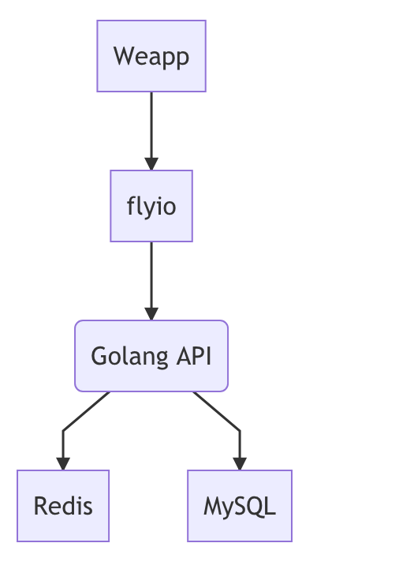
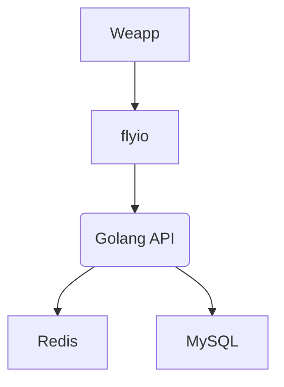
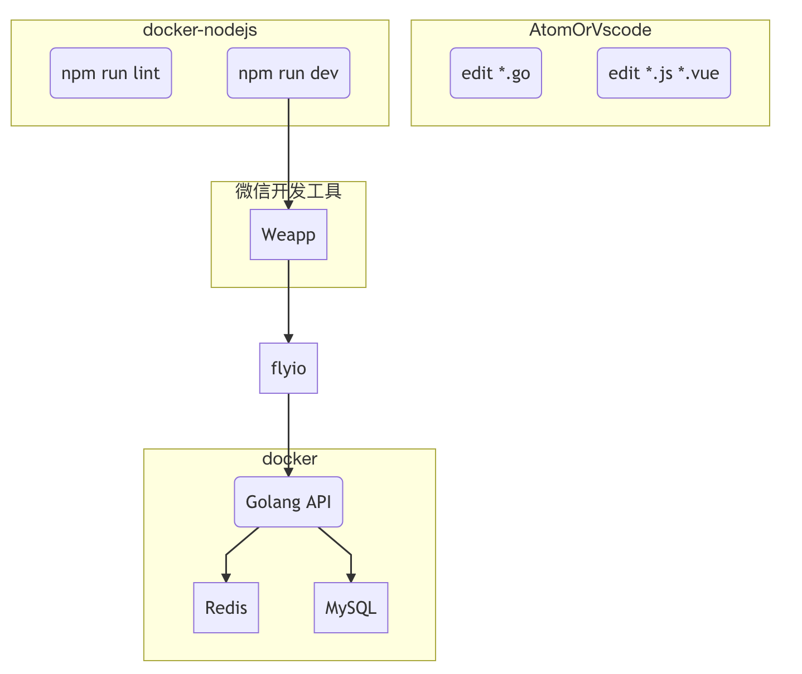
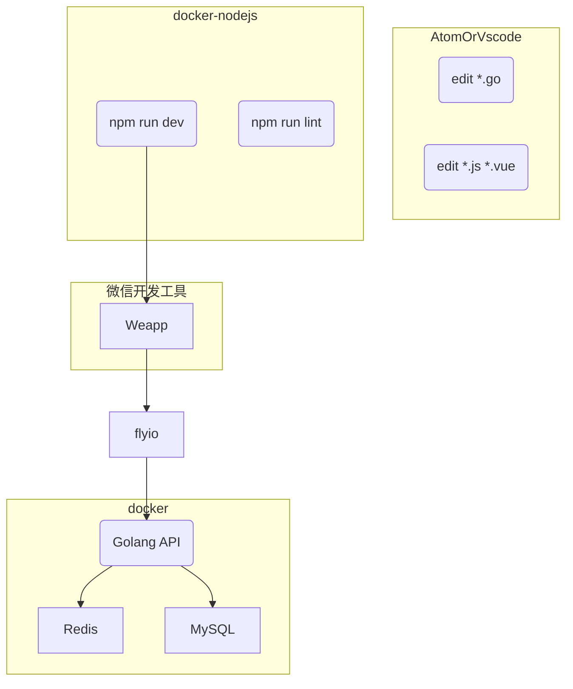

# 钢小二的小程序

> 使用 `mpvue` 构建

## 特别说明

正在开发过程中，所以代码在持续迭代中。

每个提交到Github的版本，均可以在`Shell`窗口中进行打包发布，然后使用微信开发工具打开查看。

但是功能可能不完备，也不稳定。

不可直接进行克隆，可以供开发过程中的同学参考。

## Build Setup

```bash
# install dependencies
npm install

# serve with hot reload at localhost:8080
npm run dev

# build for production with minification
npm run build

# build for production and view the bundle analyzer report
npm run build --report
```

## 网络组件

使用 `flyio`

## 关于可视化组件的说明

1. 部分图标暂时选用网易严选小程序的图标库
2. 使用有赞的`Vant-weapp`组件库

## 服务端

服务端使用`golang`基于`PaaS`模式开发，暂时不满足公开条件。



_看不到下图的同学可以看上图_



## 开发环境示意图

1. 启动 `Docker` 环境中`Redis`和`MySQL`
2. 启动 `Docker` 环境中`node.js`运行`npm run lint`
3. 启动 `Docker` 环境中`node.js`运行`npm run dev` 监听编辑器中更新的`*.js` `*.vue`
4. 启动`Docker`环境中运行的`Golang API` 比如`go run main.go`，做好随时重启的准备或者做好热更新
5. 打开微信开发工具，打开您正在进行中的微信小程序项目



_看不到下图的同学可以看上图_


